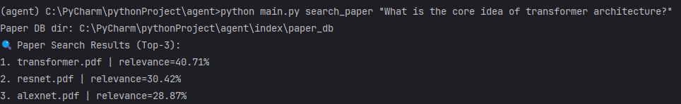
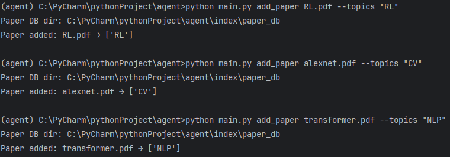
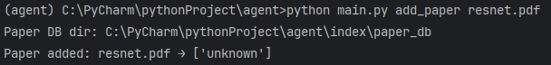
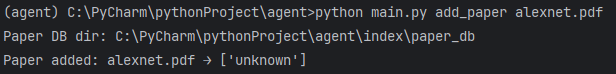
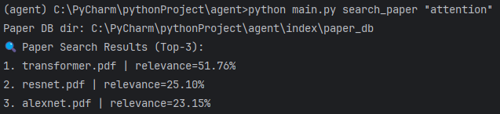
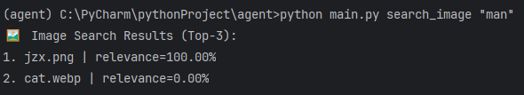

# 本地 AI 智能文献与图像管理助手（Local Multimodal AI Agent）

**Author**：石灏岩  
**Student Number**：25120361  

> 本项目为课程作业：在本地实现论文（PDF）与图像素材的语义检索、自动分类与管理。  
> 统一入口：`main.py`，支持命令行一键调用核心功能。

---

## 目录（Table of Contents）

- [1. 项目简介](#1-项目简介)
- [2. 功能概览](#2-功能概览)
  - [2.1 智能文献管理](#21-智能文献管理)
    - [2.1.1 语义搜索（search_paper）](#211-语义搜索search_paper)
    - [2.1.2 单文件处理——添加论文（add_paper）](#212-单文件处理添加论文add_paper)
    - [2.1.3 批量整理（batch_classify）](#213-批量整理batch_classify)
    - [2.1.4 文件索引](#214-文件索引)
  - [2.2 智能图像管理（search_image）](#22-智能图像管理search_image)
- [3. 系统架构与设计说明](#3-系统架构与设计说明)
- [4. 安装与环境配置（Requirements）](#4-安装与环境配置requirements)
- [5. 项目结构](#5-项目结构)
- [6. 使用方法（Quick Start）](#6-使用方法quick-start)
- [7. 常见问题（FAQ）](#7-常见问题faq)
- [8. 总结](#8-总结)

---

## 1. 项目简介

本项目实现一个**本地化部署的多模态 AI 助手**，用于对本地论文（PDF）与图像进行：

- **语义检索**：用自然语言检索最相关文件，而非仅文件名匹配  
- **自动分类**：支持单篇添加分类与 `unknown/` 的批量整理  
- **以文搜图**：通过文字描述在本地图片库中检索最匹配图片  

本项目所有核心功能均可通过命令行调用，便于评测与复现。

---

## 2. 功能概览

### 2.1 智能文献管理

文本模型使用推荐的 SentenceTransformer：`all-MiniLM-L6-v2`。

#### 2.1.1 语义搜索（search_paper）

**实现要点：**
1. 检索数据库中所有已加入知识库的论文向量。
2. 返回 **Top-3** 最相关论文文件名。
3. 创新设计：使用 **Temperature Softmax** 将 Top-3 相关度转为**相对百分比（和为 100%）**，并可控制第一名更突出、第二/第三更接近。
4. 鲁棒性设计：当数据库为空或无结果时给出清晰提示。

**示例：**  
> 图1：用户询问“Transformer 架构的核心思想是什么？”，系统返回最相关的 Top-3 论文，其中 `transformer.pdf` 排名第一。

```bash
python main.py search_paper "What is the core idea of transformer architecture?"
```



> 若你的截图不是 `.png`（例如 `.jpg`），请将图片重命名为 `1.png`~`6.png`，或同步修改 README 中的后缀。

---

#### 2.1.2 单文件处理——添加论文（add_paper）

**实现要点：**
1. 支持单 topic：论文归档到指定类别目录，并写入向量数据库。
2. 支持多 topics：同一论文可同时归档到多个目录（文件系统层面复制/归档），并写入向量数据库（向量只需入库一次）。
3. 创新设计：当不指定 `--topics` 或指定为 `unknown` 时，论文放入 `data/files/unknown/` **不入库**，用于后续批量整理。
4. 鲁棒性设计：重复添加不会引发崩溃（同名文件存在时也能继续运行）。

**示例：**

```bash
# 单 topic
python main.py add_paper transformer.pdf --topics "NLP"

# 多 topics
python main.py add_paper paper.pdf --topics "NLP,CV,RL"

# 不指定 topics：自动进入 unknown（不写入数据库）
python main.py add_paper resnet.pdf
```

> 图2、图3：依次将 `RL.pdf`、`alexnet.pdf`、`transformer.pdf`、`resnet.pdf` 加入 `RL`、`CV`、`NLP`、`unknown` 分类。




---

#### 2.1.3 批量整理（batch_classify）

**实现要点：**
1. 仅遍历 `data/files/unknown/` 中的 PDF。
2. 对每个文件，计算其向量与数据库中已入库论文的相似度，找到最相近的已知论文。
3. 将 unknown 文件归档到“最相似论文所在的类别目录”。
4. 创新设计：仅整理 unknown，不扰动用户已分类目录。
5. 鲁棒性设计：为避免错误传播与污染知识库，**整理后的论文不写入数据库**（只移动文件）。

**示例：**

```bash
python main.py batch_classify
```

> 图4：将 `unknown` 文件夹中的 `resnet.pdf` 归类至 `CV`。



---

#### 2.1.4 文件索引

文件索引功能复用 `search_paper`：通过输入核心关键词或简短短语，快速定位相关论文文件。

**示例：**

```bash
python main.py search_paper "attention"
```

> 图5：查询 `attention`，返回最相关的 Top-3 文件列表。



---

### 2.2 智能图像管理（search_image）

视觉模型使用推荐的 CLIP：`ViT-B/32`，支持以自然语言描述在本地图片库中搜索相关图片（Text-to-Image Retrieval）。

**示例：**

```bash
python main.py search_image "man"
```

> 图6：查询 `man`，系统返回最相关的 Top-3 图片，其中 `jzx.jpg`（示例）相关度最高。



---

## 3. 系统架构与设计说明

- `main.py`：统一命令行入口（子命令：`add_paper / search_paper / batch_classify / search_image`）
- `models/`：编码模型
  - `text_encoder.py`：SentenceTransformer 文本向量
  - `image_encoder.py`：CLIP 图像向量/文本向量
- `db/`：向量数据库（ChromaDB）
  - `paper_db.py`：论文向量集合
  - `image_db.py`：图像向量集合
- `utils/`：工具模块
  - `pdf_utils.py`：PDF 文本抽取
  - `image_utils.py`：图片扫描
- `data/`
  - `files/`：论文按 topic 归档（含 `unknown/`）
  - `images/`：本地图像库
- `index/`：ChromaDB 持久化索引目录（自动生成）

> 设计说明：本项目采用“模型固定 + 数据增长”的检索增强方式（Retrieval-Augmented）。  
> `add_paper` 会写入向量数据库（相当于“学习/扩充知识库”）；`batch_classify` 仅做推断与归档，不写库，避免错误累积。

---

## 4. 安装与环境配置（Requirements）

### 4.1 Python 版本

- Python **3.8+**（建议 3.10/3.11）

### 4.2 依赖安装

建议使用虚拟环境：

```bash
python -m venv .venv
# Windows
.venv\Scripts\activate
# macOS / Linux
source .venv/bin/activate

pip install -U pip
pip install -r requirements.txt
```

### 4.3 `requirements.txt`（建议内容）

将下列内容保存为项目根目录的 `requirements.txt`：

```text
sentence-transformers
chromadb>=0.5.0
torch
pillow
pymupdf
git+https://github.com/openai/CLIP.git
```

> 注意：如果你曾经安装过 PyPI 上的 `clip`（非 OpenAI CLIP），请先卸载：  
> `pip uninstall clip -y`

---

## 5. 项目结构

```text
agent/
├── main.py
├── models/
│   ├── text_encoder.py
│   └── image_encoder.py
├── db/
│   ├── paper_db.py
│   └── image_db.py
├── utils/
│   ├── pdf_utils.py
│   └── image_utils.py
├── data/
│   ├── files/
│   │   └── unknown/
│   └── images/
├── index/                 # 运行后自动生成（向量索引）
├── screen_shots/
│   ├── 1.png
│   ├── 2.png
│   ├── 3.png
│   ├── 4.png
│   ├── 5.png
│   └── 6.png
└── README.md
```

---

## 6. 使用方法（Quick Start）

### 6.1 添加论文（入库 + 归档）

```bash
python main.py add_paper path/to/paper.pdf --topics "NLP,CV"
```

- `--topics`：逗号分隔，多标签可同时指定  
- 不指定 `--topics`：默认进入 `data/files/unknown/`，**不写入数据库**

---

### 6.2 语义搜索论文（Top-3 + 相对分数）

```bash
python main.py search_paper "transformer architecture"
```

---

### 6.3 批量整理 unknown 文件夹

```bash
python main.py batch_classify
```

---

### 6.4 以文搜图（Top-3 + 相对分数）

将图片放入 `data/images/` 后执行：

```bash
python main.py search_image "sunset by the sea"
```

---

## 7. 常见问题（FAQ）

### Q1：`clip` 没有 `load` 方法？
你可能安装了错误的 `clip` 包。解决方法：
```bash
pip uninstall clip -y
pip install git+https://github.com/openai/CLIP.git
```

### Q2：向量库为空 / 搜索不到结果？
请确认你已用 `add_paper` 添加至少一篇论文（只有 `unknown/` 的文件不会入库）。  
`index/paper_db/` 下应能看到 `chroma.sqlite3` 等文件。

---

## 8. 总结

本项目完成了课程要求的核心功能，并在工程层面加入了：
- Top-3 结果展示与相对分数归一化（Temperature Softmax）
- unknown 隔离策略，避免错误样本污染知识库
- 本地向量库持久化，保证多次运行可复现


